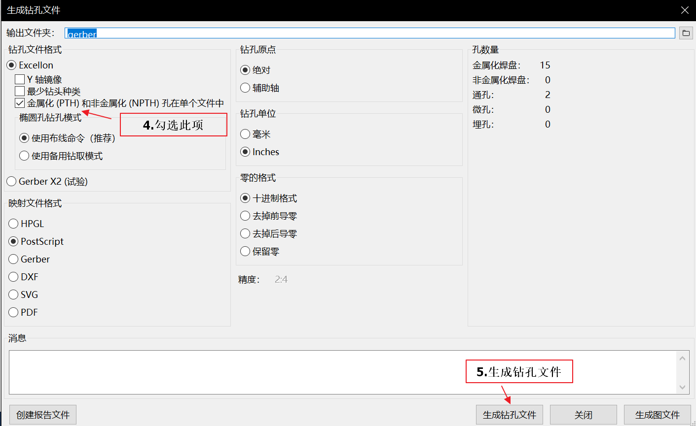

# 电赛KiCad教程

#### 介绍

KiCad是一款开源免费的PCB设计工具，得益于开源的优势，KiCad内置了由社区维护的丰富元器件库，从而免去反复画封装的痛苦。同时KiCad也是开放的，其文件基于文本格式储存，可以很方便的导入导出。在原理图绘制的部分，KiCad与各大EDA软件大致相同。在PCB绘制的部分工具和规则相比专业级工具要简单很多，这恰好避免初学者陷入复杂规则的“蜘蛛网”中。同时，KiCad也具有很高的社区热度。总的来说，KiCad是业余爱好者快速硬件设计的不二之选。

#### 文档结构

1.  软件操作注意事项
2.  快速绘制符号、封装
3.  PCB的阻抗控制
4.  PCB的规则检查
5.  导出用于制造的Gerber文件
6.  PCB送厂注意事项

#### 软件操作注意事项

1.  路径中只包括英文字母和下划线
2.  按住Ctrl(Windows) Cmd(OS X)可以把线走直
3.  PCB选中元器件一般要选择“封装”而不是焊盘，按F将元器件换层
4.  按ESC退出当前状态

#### 快速绘制符号、封装

1.  [原理图符号生成器](http://kicad.rohrbacher.net/quicklib.php)
2.  两种符号的绘制方式
    
3.  使用阵列工具快速生成封装（选择焊盘后右键-创建阵列）
    

#### PCB的阻抗控制

1.  使用自带的“PCB计算器”
    
2.  在嘉立创做板，可以用[阻抗神器](https://www.sz-jlc.com/weixin/calculation/impedance.html)
3.  阻抗控制的走线下地平面必须完整
4.  使用共面波导+地平面的结构，需要沿着传输线打过孔
    
5.  走线尽量短，转弯使用45度角

#### PCB的规则检查

1.  投产前使用DRC检查是否存在违例
2.  可依据制造商的工艺参数设置最小间距等
    

#### 导出用于制造的Gerber文件

1.  详见图片
    

    
    
2.  完成后，将工程目录的gerber文件夹（之前设置的输出文件夹）打包为.zip后，将zip文件送厂

#### PCB送厂注意事项

1.  再次确认板厚，是否与设计阻抗时的一致；如果是四层板，选择正确的层叠结构
2.  设计参数应高于极限参数
3.  对于非常规设计，选择“需要生产确认稿”
4.  对于贴片元件多的板子可以使用SMT，或开钢网
