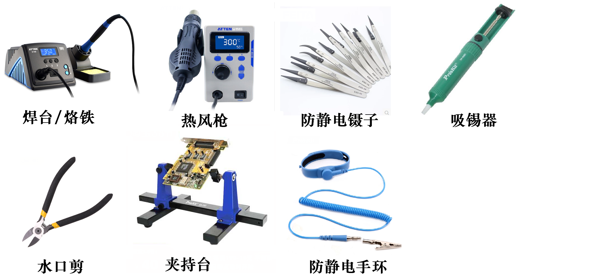
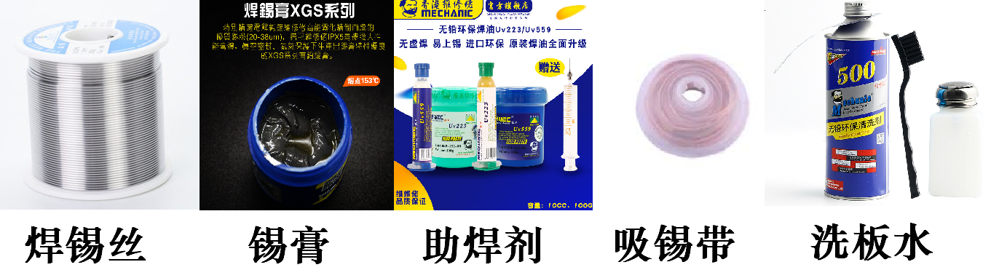
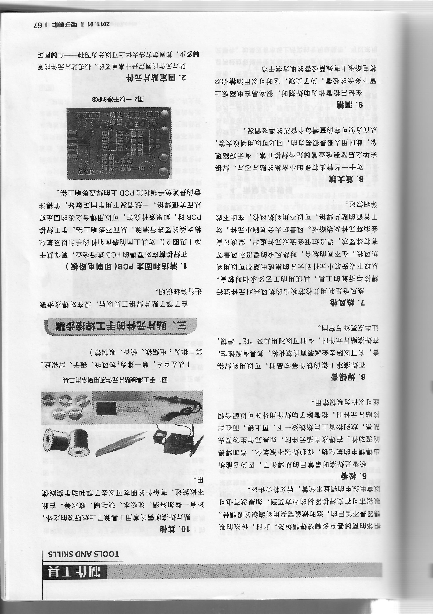
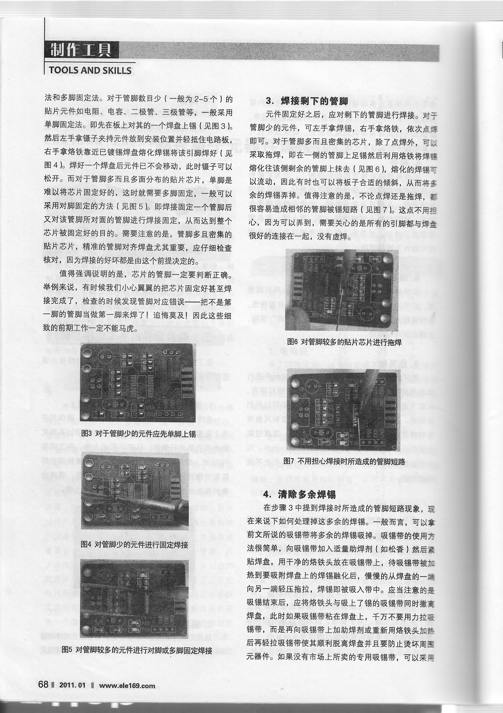
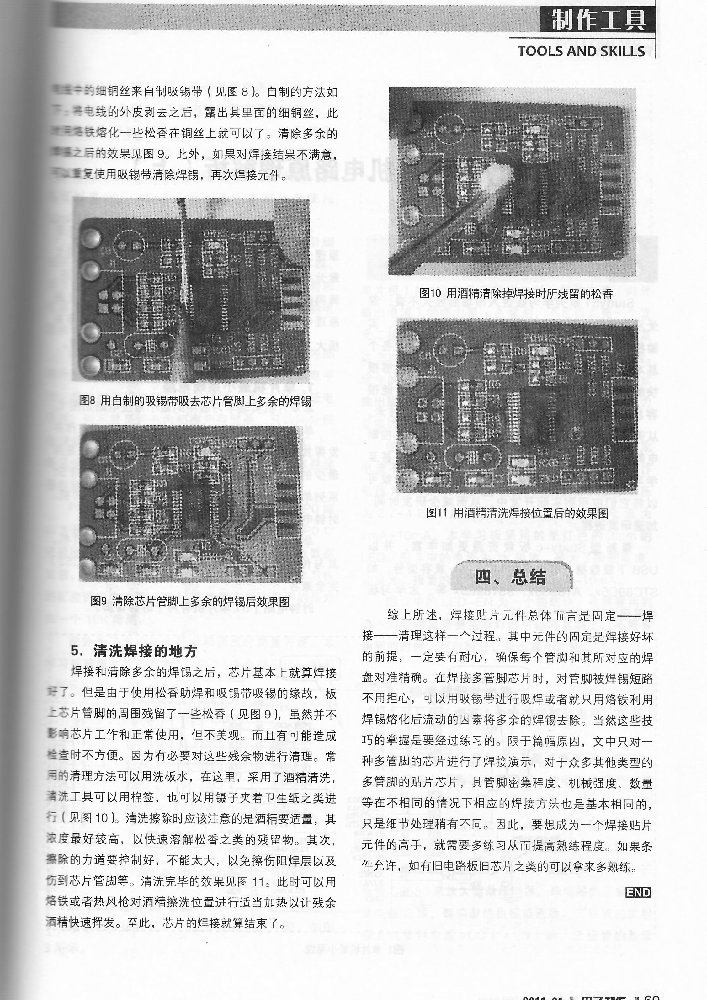
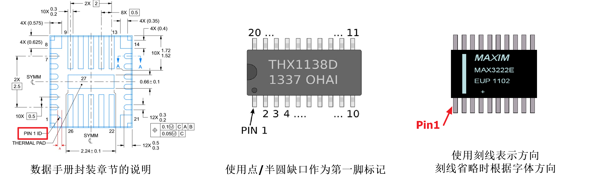

# PCB焊接指南

## 焊接工具
要想实现高质量的贴片元件焊接，需要使用合适的工具。使用不恰当的焊接工具会导致焊接质量不可控、元器件或电路板损毁。主要的工具如下表所示:

|工具|作用|注意事项|
|-|-|-|
|烙铁|加热焊点、焊盘上锡|**恒温带接地**的刀头或尖头烙铁|
|热风枪|焊接和拆卸贴片元件、偏脚SMA头|有温控且可最高可达400℃的热风枪|
|防静电镊子|夹持各类微贴片器件|尖头**无磁**ESD镊子，注意保护以免损坏尖头|
|吸锡器|用于元件的拆焊|无|
|水口钳|用于各种剪切|无|
|夹持台|用于夹持电路板方便焊接|无|
|防静电手环|用于将人体接地，避免静电打坏芯片|实验室接地的方法：可调电源插上插座，将防静电手环连接到中间绿色接线柱上|

## 焊接耗材
焊接耗材分为焊料、助焊剂和其他耗材

|耗材|作用|注意事项|参考价格|
|-|-|-|-|
|焊锡 | 主要焊料，内嵌助焊剂辅助焊接(**必备**)| 选择粗细适合（0.5mm），合金成分为**63Sn/37Pb**，含助焊剂的有铅焊锡 | <100¥[250g(0.5mm)] |
|焊锡膏|用于钢网印刷焊接，也可手动涂敷|合金成分**63Sn/37Pb**，密封保存，敞开过久**会失效**| 20~30¥[60g] |
|助焊剂 | 增强焊锡流动性，去氧化(**必备**) | 选择针管松香基助焊剂，如维修佬助焊剂，焊接完成后1h内清洗| 10~30¥[10mL] |
|吸锡带 | 处理焊盘上多余的锡，解决芯片引脚连锡 | 消耗品，要把用过的地方剪掉| 5~10¥[1.5m] |
|洗板水|用于清洗电路板，需要配合刷子使用|有刺激性气味，易燃|20~30¥[800g]|

## 焊接预备

1. 确认烙铁可靠接地
    - 使用三芯电源线，并用万用表检测地线是否是通的（在没插上去的时候，测两端）
    - 烙铁触碰板子上的LED不会点亮它
2. 确认做好防静电措施，用ESD镊子接触器件而不要用手。有条件请戴好防静电手环。

## 焊接方法
在SMT的手工焊接中，因为焊点较多，且有不少元器件有底部焊盘（烙铁接触不到），推荐使用以风枪为主、烙铁为辅的焊接方法。根据焊料供给方法不同，可以分为烙铁上锡工艺和锡膏工艺两种。

### 烙铁上锡工艺
1. 使用烙铁和焊锡丝将每个焊盘都上锡，烙铁温度不应该超过300°、也不得用力刮蹭以免损坏焊盘，沿长边拖焊盘。
    - 如果焊盘较大，切忌上太多的锡，以中间不隆起为标准
    - 如果焊盘是接地焊盘，可能难以用烙铁上锡（散热过快），可以用风枪辅助加热
    - 遇到连锡的情况，是因为焊锡自带的助焊剂已经完全挥发了，只需添加一些助焊剂再加热即可
    - **上锡必须平整**，在有助焊剂的情况下，焊锡流动性好，如“水滴”状，因此形成的一致性好的上锡效果
2. 向所有要焊接的元件的焊盘加上助焊剂
3. **识别元器件的方向**（详见后文）后，将元器件对准焊盘放置，此时元器件应该能自动黏附。
4. 启动风枪，温度设置为350℃~400℃
    - 首先离PCB约10cm吹进行预热到助焊剂开始融化，助焊剂化开能更好的固定元件位置。如果元件“飘走”，可用镊子推回。
    - 按照一定的顺序依次靠近（2~3cm)并集中加热各个元件，当焊盘上的锡融化，元器件会有“归位”的动作，并向下“沉”到PCB上。若元器件位置偏移，可以用镊子轻推纠正。
5. 视觉检查焊接质量，识别漏焊、虚焊和连锡的情况。
    |焊接缺陷|处理方法|
    |-|-|
    |漏焊|可以通过用烙铁“洗脚”的方式加焊，操作方法是给引脚加助焊剂后，依次单独加热每个引脚，**点到为止，不要长时间加热**，若焊盘根本没有上锡，需要同时辅以细焊锡丝（约0.3mm)|
    |虚焊|修复方法同上，但前期可能看不出来，需要在调试的时候才能发现|
    |连锡| 1. 类似补焊，只是需要更多的技巧。**助焊剂一定要足量**，否则锡可能进入引脚下面（那样就需要把芯片吹下来）。使用没有多余锡的刀头或平口烙铁加热连锡处，此时多余的锡将自动吸附到烙铁上。若技术不够，可以尝试使用吸锡器   2. 使用吸锡带。将吸锡带从圆盘中取出一段，减去已经吸附足量锡的部分，然后将铜编制网（即吸锡带有效部分）贴附到连锡处，用烙铁*压热*，感觉到融化后脱离即可。注意脱离时应该没有阻力，否则说明加热不足，**不得蛮力拉扯**，否则极有可能损坏电路板 |
6. 使用**酒精**或**洗板水**洗去板子上的助焊剂及其他残渣。**以上两种均易燃，使用时远离烙铁和风枪**。某些助焊剂含有腐蚀性成分或具有导电性，不清洗可能严重影响电路板长期可靠性。
### 锡膏工艺
1. 涂敷锡膏
    - 无钢网（可能速度较慢，且如果锡膏涂敷不当，可能导致芯片底部残锡导致短路，建议用烙铁上锡）首先用热风枪**将PCB加热到60~80℃**，用牙签挑取一些锡膏抹在焊盘上，此时锡膏应该自动化开并黏附。温度降低后很难黏附，需要继续加热。所有的贴片焊盘都需要涂敷（包括元器件底部的**Exposed Pad**）
    - PS.也可以用流动性好的针管封装锡膏，请认准合金成分为*63Sn37Pb*的锡膏，**不要用含Bi的“低温锡膏”**（机械强度极差）
    - 有钢网，使用钢网对准PCB后，用胶带固定PCB到钢网上，使用**焊锡膏**涂在钢网的孔位处，使用**刮刀**刮平，全部覆盖平整后，小心翼翼地将PCB沿垂直方向从钢网上分离下来。

2. 按照“烙铁上锡工艺”的3、4、5、6步操作，锡膏内含助焊剂，无需另外添加。

### 纯烙铁操作

## 注意事项

- 风枪加热是AOE伤害
- 元器件方向的辨认
    